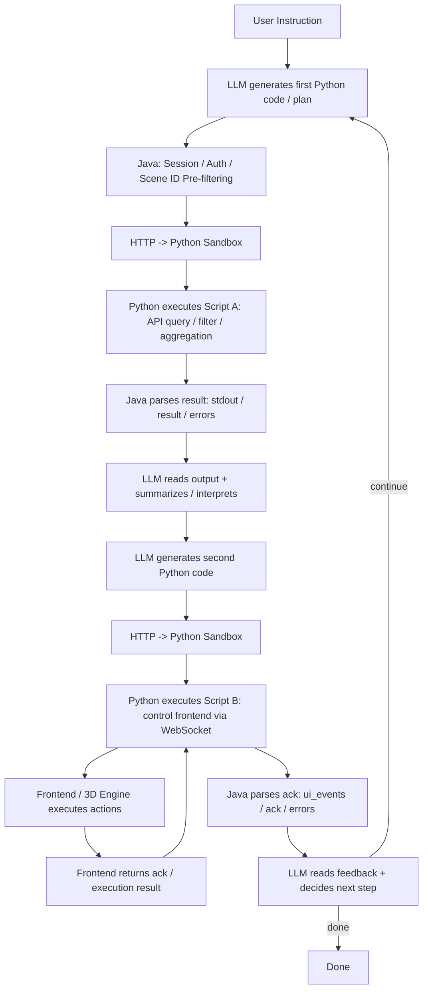

---
categories:
  - Technology
  - Ai
date: "2025-12-18 00:00:00"
description: Lessons from a Digital Twin System(1)
readingTime: 8
title: 'A Practical Attempt at MCP-as-Code: Lessons from a Digital Twin System'
---

# **A Practical Attempt at MCP-as-Code: Lessons from a Digital Twin System**

## **Background: This Is a Scale-First Problem**

In the digital twin system I work on, a single scene can easily contain **tens of thousands of entities**.

Each entity may carry 2,000–3,000 tokens worth of attributes—state, metrics, and domain-specific properties.

But the real issue appears even earlier.

For example, in some scenes there may be

over ten thousand buildings

Simply passing the list of building IDs to an LLM already consumes enough tokens to severely pressure the context window—before any attributes or business logic are involved.

This leads to a hard constraint:

Any architecture that relies on pushing “complete scene data” into the LLM context and then asking the model to reason over it does not scale.

Even aggressive trimming or summarization only delays the problem.

---

## **The Original Setup: Direct MCP Tool Calls**

Before the refactor, I was using a relatively straightforward MCP Tool–based approach:

- Inject two groups of MCP tools into the model:
  - One for querying scene data
  - One for controlling the 3D scene (coloring, hiding, transforming entities)
- The LLM acted more like a dispatcher:
  - Call an API
  - Read the result
  - Call another API
For a request like *“Paint all buildings red”*, the flow was simple:

1. Call a tool to fetch all building IDs
1. Call another tool to apply the color change
This approach had two strong advantages:

- Low latency
- Early failure (parameter types and schemas were validated before execution)
However, as scene complexity increased, this model started to hit its limits.

---

## **The First Bottleneck: Context Size vs. Data Volume**

The core problem was not data access—it was **data exposure**.

- Too many entities
- Highly dynamic schemas
- Extremely large attribute payloads
What became clear over time was this:

The LLM does not need *all*

It needs to decide how the data should be processed

In other words, the model should express *logic*, not absorb massive datasets.

---

## **The Turning Point: MCP-as-Code from Anthropic**

At this point, I came across Anthropic’s article:

Code Execution with MCP

https://www.anthropic.com/engineering/code-execution-with-mcp

The key idea resonated immediately:

- Treat the MCP server as a codebase / API
- Stop injecting every tool as a JSON schema
- Instead:
  - Let the model write code (Python or TypeScript)
  - Execute it inside a sandbox
  - Return only summarized results, not raw data
One sentence from the article stood out to me:

For large datasets, the model doesn’t need to see 10,000 rows—it just needs the top 5 results or an aggregate.

This felt like the right abstraction for my problem.

---

## **What I Expected MCP-as-Code to Solve**

Before implementing it, my expectations were clear:

- Large-scale filtering and aggregation would happen outside the LLM
- The model would only see results
- Context pressure would drop dramatically
- The LLM would evolve from a “tool selector” into a logic author
Conceptually, it was a very clean design.

---

## **The Actual Implementation: Java + Python Sandbox**

Rather than replacing everything, I introduced MCP-as-Code incrementally.

### **Java Layer**

- Session management
- API invocation
- Scene ID pre-filtering
  (e.g., verifying which entity IDs are currently present in the frontend scene)
### **Python Sandbox**

- Communicates with Java via HTTP
- Executes Python code generated by the LLM
- Calls MCP APIs or controls the frontend via WebSocket
- Returns:
  - stdout
  - result
  - ui_events
  - errors
From an execution-model perspective, the system shifted to:

Write code → Execute → Interpret result → Write more code

The diagram below illustrates the actual execution flow between the LLM, the Java core system, the Python sandbox, and the frontend after the MCP-as-Code refactor.

It is important to note that, in real interactive scenarios, this execution chain is frequently interrupted and runs as a multi-round loop

This execution model differs significantly from the original assumption of *“a single script completing multiple steps in one run”*, and it is precisely this gap that underlies the increased latency and higher failure costs discussed later in the article.

---

## **Problem 1: The Execution Chain Gets Interrupted**

My original assumption was:

One Python script could execute multiple steps, effectively replacing multiple MCP tool calls in a single run.

In practice, this assumption failed in an interactive digital twin environment.

### **What actually happens**

A typical request now looks like this:

1. The LLM writes a Python script to query or filter entity IDs
1. Java/Python executes it and returns the result
1. The LLM must read and interpret the output
1. The LLM writes a second Python script to control the frontend via WebSocket
1. The frontend executes the action and returns feedback
1. The LLM decides whether another step is needed
In other words:

The script is frequently forced to stop after a small step

What was intended as *one multi-step execution* degrades into **multiple serial round-trips**.

---

## **Problem 2: Latency and Failure Costs Increase**

### **Latency**

Even very simple instructions such as:

 Paint all buildings red”

- Took ~2 seconds in the original MCP Tool model
- Often exceeded 10 seconds with MCP-as-Code
The causes were cumulative:

- Dynamic schema exploration
- Multiple LLM generations
- Python execution overhead
- Java ↔ Python ↔ Frontend round-trips
### **Failure Model Differences**

Another important shift was where failures occur.

In the original MCP Tool approach:

- Java-side JSON schema validation
- Type errors rejected before execution
- Errors were structured and concise
In the Python sandbox approach:

- Errors occur at runtime
- Common outcomes include:
  - KeyError
  - AttributeError
  - Full stack traces
- The LLM must:
  1. Read the stack trace
  1. Understand the failure
  1. Rewrite the entire script
  1. Re-execute
In a system with **strong schemas, real-time interaction, and high frequency**, this difference becomes very expensive.

---

## **Takeaway: MCP-as-Code Is Not a Silver Bullet**

This refactor led me to a clear conclusion:

MCP-as-Code is extremely powerful for **c**omplex analysis and large-scale data processing

but in high-frequency, interactive, schema-constrained digital twin systems

Tool-based execution and code-based execution are not competing solutions—they solve different classes of problems.

In this post, I primarily examined the behavioral differences between MCP and Code-as-MCP in digital twin scenarios, starting from concrete implementations and empirical observations.

In the next post, I will introduce an abstract model to analyze the underlying causes of these differences from the perspectives of system state, observability, and interaction structure, and to clarify their respective applicability boundaries.

Looking back at the MCP-as-Code refactoring process, three classes of issues repeatedly surfaced:

1. The number of interaction rounds becomes unavoidable.
1. Failures tend to occur *during execution* rather than *before execution*.
1. Under the same user instruction, latency and failure costs grow exponentially.
These issues are not determined by whether the system is implemented in Java or Python, nor by the specific design of MCP APIs.

Instead, they are better understood as manifestations of underlying structural constraints.

To avoid continuing trial-and-error at the implementation level, I introduce a more abstract model to describe these phenomena in a unified way.

In the following sections, I will use a layered abstraction model to re-examine where the differences between MCP and Code-as-MCP actually come from.

