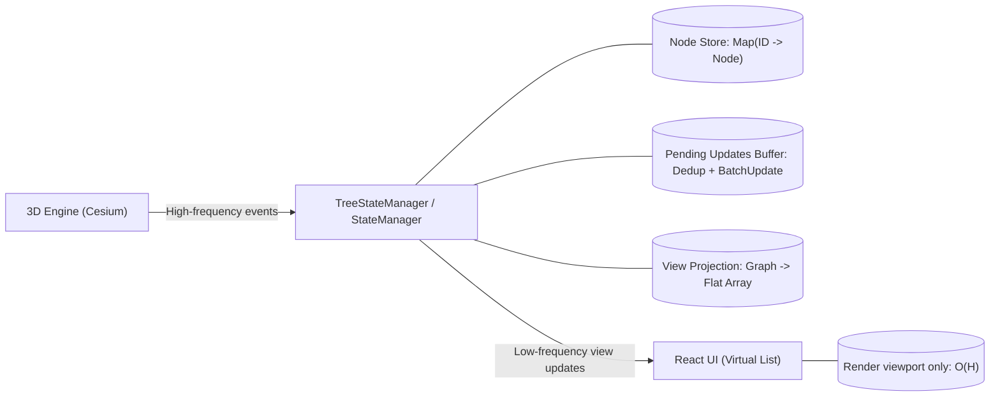

We’re used to the data-driven UI mindset in traditional React development: when state changes, the UI changes.


But when our data source isn’t a user-input form, but a 3D engine (like Cesium) that’s changing wildly every second, the traditional React model can cause the page to crash outright.


Today I want to share how we “put reins” on a sprinting Cesium engine so it can peacefully coexist with React.


## 1. The Core Conflict: UI Thread vs Render Loop


In web development, there are two fundamentally different update models:

- React (UI Thread): declarative, updates on demand. It pursues correctness; any state change triggers diffing and re-rendering.
- 3D Engine (Game Loop): imperative, continuously refreshes at 60FPS. State changes are extremely frequent (Loading/Culling/Moving).

When a 3D scene loads a large number of models, Cesium can emit hundreds or thousands of “node added” events in a short time. If we use the naive onEvent -> setState pattern, the main thread gets blocked instantly, and the page becomes unresponsive.


## 2. The Abstraction Model: Scene-Graph Projection & Synchronization


To solve the rate mismatch, we established a core idea: Tree State in React is no longer the Source of Truth—it’s just a low-frequency projection of the 3D world.


We built the following architecture:





We introduced a class, TreeStateManager, that exists independently of React’s lifecycle. It’s not just a data cache—it’s the system’s Source of Truth and traffic valve.


It takes on three key responsibilities:


### 1. State Holding & O(1) Indexing (State Holding)


It maintains a complete node database in memory.

- It builds a full index using `Map<ID, Node>`, ensuring any operation that looks up a node by ID (e.g., mapping a Cesium click event back to a tree node) is O(1).
- It preserves persistent node states (Opened/Checked). These states exist independently of the UI, so even if components unmount and remount, the state remains.

### 2. Traffic Shaping (Traffic Shaping)


Faced with thousands of state-change events (Add/Remove/Update) that may flood in from the 3D engine in an instant, the StateManager acts like a levee.

- Deduplication: multiple modifications to the same node within the same millisecond (e.g., turning red then green) keep only the final state.
- Buffering: instead of notifying the UI per event, it maintains a pendingUpdates queue and uses a batchUpdate mechanism to merge high-frequency, granular updates into a single low-frequency view update.

### 3. View Projection (View Projection)


It decides “how the data is viewed.” Based on the current SortType (e.g., sorting by CAD structure, sorting by entity type), it dynamically takes the nonlinear in-memory data (Graph) and computes, in real time, the linear array (Flat Array) needed by the UI.


This means there’s only one copy of the underlying data, but there can be countless “views.” Switching views is just recomputing a projection, with very low cost.


## 3. Key Implementation Strategies


For the deep nesting common in 3D scenes, I abandoned the intuitive “recursive component” approach.


In early experiments, I found that when tree depth increases and node counts become large, recursive React components incur a huge performance penalty:

1. Call stack overflow risk: a deeply nested component tree greatly increases pressure on the JS engine’s call stack.
2. Diff cost rises sharply: when React reconciles a very deep component tree, the diff algorithm’s cost increases significantly, causing FPS to fall off a cliff.

So we maintain a flattened array flatNodeArray in memory, using a depth property to indicate hierarchy.

- Advantage: a virtual list can consume this array directly. React only needs to render a few dozen divs in the viewport, decoupling render complexity from total data size (N); it depends only on viewport height (H), i.e., O(H).
- Operation: expanding/collapsing nodes only involves filtering the array, no longer requiring expensive DOM tree redraws.

### Strategy B: Asynchronous Time Slicing (Time Slicing)


This is the key to preventing “freezing.” Not only do we use batching, we also split the build work into multiple micro-tasks.


```javascript
// Pseudocode logic
while (queue.length>0) {
  process(queue.splice(0,100)); // process a small batch
  awaitnextTick();              // yield the main thread, allow UI to respond to interactions
}


```


## 4. Performance Dividends in Feature Implementation from Data Structures


Architectural choices often don’t just solve today’s performance problems—they also simplify future feature implementation. The most typical example is Shift+multi-select.


In the old version (a recursive-tree-based approach), when we performed “range select all” on a 4-level deep tree containing 20,000 nodes, the browser would freeze for around 10 seconds. The algorithm had to recurse heavily through a deeply nested DOM tree to find paths and states.


But under our flattened array (Flat Array) architecture, this becomes straightforward:


```javascript
// Pseudocode: implement range selection in a flat array
constrangeSelection= (startId,endId)=> {
conststartIndex=nodePositionMap.get(startId);
constendIndex=nodePositionMap.get(endId);

// no matter how complex the tree is, the visual range is just an array slice by index
returnflatNodeArray.slice(
Math.min(startIndex,endIndex),
Math.max(startIndex,endIndex)+1
    );
};


```


Another example: the most complex state in a tree control is checkbox cascade updates (select all / deselect all).


In a traditional recursive tree, checking a parent with 20,000 children means triggering 20,000 React component re-renders—an absolute performance disaster. In our architecture, this is simplified to pure in-memory operations:

1. Index lookup: use Map to instantly locate all 26,000 descendant node IDs.
2. Batch modification: update the data store directly without touching the DOM.
3. On-demand drawing: VirtualList only redraws the 20 visible rows on screen. Result: no matter how many nodes are cascaded, rendering cost stays constant at O(1).

## 4. Experimental Data & Performance Validation


To verify scalability, we ran performance instrumentation tests in two real scenarios: a medium scale and a high-load scale.


Test environment: Chrome / M2 Chip


Comparison: Medium scenario (7,000 Nodes) vs Advanced scenario (68,500 Nodes)


Below are measured results across three major scenarios:


### Experiment 1: View Build & Render Performance (Build & Render)


This is the most basic performance metric, measuring whether this “flattening + time slicing” architecture can withstand large data volume.


| Key Metric                       | Medium Scenario (7k Nodes) | Heavy Scenario (6.8w Nodes) | Architectural Interpretation                                                                                                                                                                                                                         |
| -------------------------------- | -------------------------- | --------------------------- | ---------------------------------------------------------------------------------------------------------------------------------------------------------------------------------------------------------------------------------------------------- |
| Tree:Flatten (flatten hierarchy) | 0.8 ms                     | 4.3 ms                      | Core validation: reorganizing tens of thousands of hierarchical relationships into a linear list takes only 4ms. This proves perfect linear scalability (Linear Scalability) and stays far below the 16ms/frame safety line.                         |
| Tree:FullBuild (full build)      | 290 ms                     | 2,804 ms                    | Although data volume increased 10x and time also increased linearly, thanks to time slicing (Time Slicing), these 2.8 seconds were spread across hundreds of event loop ticks. The UI remained fully interactive during this period with no stutter. |

undefined
### Experiment 2: Interaction Responsiveness (Shift+Select Range)


This is the ultimate stress test for the architecture. We ran a “hidden select all” test in a 3D scene: the user selected only a few dozen folders in the visible area, but each contained tens of thousands of folded 3D entities.


| Operation Scenario     | Traditional Recursive Tree (Estimated) | This Architecture (Measured) | Improvement |
| ---------------------- | -------------------------------------- | ---------------------------- | ----------- |
| Select 80,000 entities | ~10,000 ms (browser freeze)            | 263 ms                       | ~40×        |

undefined
Interpretation: previously, computing the “visual range” between two nodes required complex recursive tree traversal and could easily lock the main thread. In a flattened array, this degenerates into a simple `Array.slice` operation (plus subsequent ID collection). Even processing 80,000 objects can finish in ~260ms.


### Experiment 3: Cascading State Updates (Checkbox Cascade)


This tests performance when the user clicks “select all” on the root node and the system recursively updates all descendant states.


| Metric            | Data Scale   | Time    | Result             |
| ----------------- | ------------ | ------- | ------------------ |
| Tree:CheckCascade | 26,419 nodes | 72.6 ms | Real-time response |

undefined
Interpretation: thanks to Map indexing (O(1)) and in-memory state operations, we can synchronize the states of 26k+ components in just over 70ms. To the user, this feels like instant feedback.


These three experiments are enough to prove: when data scale grows from 7,000 to 70,000 (10× pressure), the system’s core performance metrics remain within a linearly controllable range, without exponential collapse.


## 5. Summary


When dealing with the complex engineering of combining a 3D engine with React, it’s easy to fall into a trap: trying to patch performance holes with more complicated React techniques (memo, useMemo).


But this architecture shows: the ultimate solution to performance problems often isn’t incremental code-level tweaks, but a restructuring of the underlying data logic.


By introducing a middle-layer architecture, we isolated the violent 3D render loop from the quiet UI thread; by reducing dimensionality of data, we downgraded O(N) DOM operations into O(1) array operations.


This not only solves the performance bottleneck of Cesium scene trees, but also provides a general architectural pattern for any massive real-time data visualization (such as stock quotes, log monitoring, complex tables):

1. Think beyond the framework: don’t let React’s declarative model constrain you; manage your own data flow in side effects.
2. Embrace eventual consistency: within millisecond-level gaps imperceptible to humans, use batching and time slicing to trade consistency for throughput.
3. Win with data structures: when facing tens of thousands of nodes, choosing Flat Array vs Recursive Tree can matter more than writing 1,000 lines of optimization code.

Hope this experience of “taming a sprinting engine” can bring you some inspiration for solving similar high-frequency synchronization challenges.
