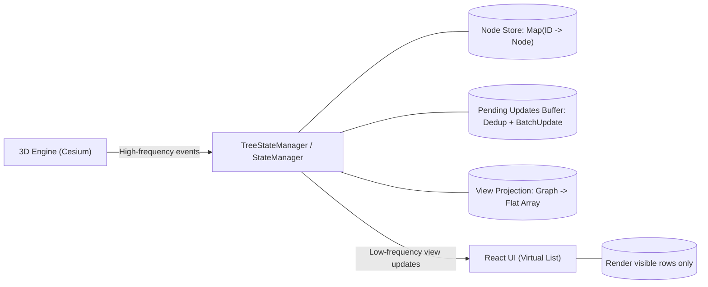

We’re used to the data-driven UI mindset in traditional React development: when state changes, the UI changes.


But when our data source isn’t a user-input form, but a 3D engine (like Cesium) that’s changing wildly every second, the traditional React model can cause the page to crash outright.


Today I want to share how we “put reins” on a sprinting Cesium engine so it can peacefully coexist with React.


## 1. The Core Conflict: UI Thread vs Render Loop


In web development, there are two fundamentally different update models:

- React (UI Thread): declarative, updates on demand. It pursues correctness; any state change triggers diffing and re-rendering.
- 3D Engine (Game Loop): imperative, continuously refreshes at 60FPS. State changes are extremely frequent (Loading/Culling/Moving).

When a 3D scene loads a large number of models, Cesium can emit hundreds or thousands of “node added” events in a short time. If we use the naive onEvent -> setState pattern, the main thread gets blocked instantly, and the page becomes unresponsive.


## 2. The Abstraction Model: Scene-Graph Projection & Synchronization


To solve the rate mismatch, we established a core idea: Tree State in React is no longer the Source of Truth—it’s just a low-frequency projection of the 3D world.


We built the following architecture:



```mermaid
flowchart LR
  A["3D Engine (Cesium)"] -->|High-frequency events| B["TreeStateManager / StateManager"]

  B --- D[("Node Store: Map(ID -> Node)")]
  B --- E[("Pending Updates Buffer: Dedup + BatchUpdate")]
  B --- F[("View Projection: Graph -> Flat Array")]

  B -->|Low-frequency view updates| C["React UI (Virtual List)"]
  C --- G[("Render visible rows only")]

```


We introduced a class, TreeStateManager, that exists independently of React’s lifecycle. It’s not just a data cache—it’s the system’s Source of Truth and traffic valve.


It takes on three key responsibilities:


### 1. State Holding & O(1) Indexing (State Holding)


It maintains a complete node database in memory.

- It builds a full index using `Map<ID, Node>`, ensuring any operation that looks up a node by ID (e.g., mapping a Cesium click event back to a tree node) is O(1).
- It preserves persistent node states (Opened/Checked). These states exist independently of the UI, so even if components unmount and remount, the state remains.

### 2. Traffic Shaping (Traffic Shaping)


Faced with thousands of state-change events (Add/Remove/Update) that may flood in from the 3D engine in an instant, the StateManager acts like a levee.

- Deduplication: multiple modifications to the same node within the same millisecond (e.g., turning red then green) keep only the final state.
- Buffering: instead of notifying the UI per event, it maintains a pendingUpdates queue and uses a batchUpdate mechanism to merge high-frequency, granular updates into a single low-frequency view update.

### 3. View Projection (View Projection)


It decides “how the data is viewed.” Based on the current SortType (e.g., sorting by CAD structure, sorting by entity type), it dynamically takes the nonlinear in-memory data (Graph) and computes, in real time, the linear array (Flat Array) needed by the UI.


This means we maintain one underlying node store and can derive different views from it. Switching views still requires recomputing a projection; a full traversal or sort grows with the number of nodes.


## 3. Key Implementation Strategies


For the deep nesting common in 3D scenes, I abandoned the intuitive “recursive component” approach.


In early experiments, I found that when tree depth increases and node counts become large, recursive React components incur a huge performance penalty:

1. If the tree-building logic itself uses deep recursion, it can hit JavaScript call stack limits. A deeply nested component structure is also harder to maintain.
2. Mounting or updating many nodes increases reconciliation and DOM work. We observed poor frame rates, but that observation does not establish exponential diff complexity.

So we maintain a flattened array flatNodeArray in memory, using a depth property to indicate hierarchy.

- Advantage: a virtual list renders only the visible rows. The rendering work for one update depends mainly on the number of visible rows V, rather than the total node count N.
- Cost: expanding, collapsing, or changing sort order may still traverse or rebuild the visible-node array. Virtualization does not make those data operations O(V).

### Strategy B: Asynchronous Time Slicing (Time Slicing)


Batching helps, but a large build can still block the main thread. We split it into batches and yield to the browser between them. Awaiting an already resolved Promise would only queue another microtask and would not guarantee a paint opportunity.


```javascript
// Pseudocode inside an async function
for (let offset = 0; offset < items.length; offset += 100) {
  process(items.slice(offset, offset + 100));
  await new Promise(requestAnimationFrame); // allow the browser another frame
}


```


## 4. Performance Dividends in Feature Implementation from Data Structures


Architectural choices often don’t just solve today’s performance problems—they also simplify future feature implementation. The most typical example is Shift+multi-select.


In the old version (a recursive-tree-based approach), when we performed “range select all” on a 4-level deep tree containing 20,000 nodes, the browser would freeze for around 10 seconds. The algorithm had to recurse heavily through a deeply nested DOM tree to find paths and states.


But under our flattened array (Flat Array) architecture, this becomes straightforward:


```javascript
// Pseudocode: implement range selection in a flat array
const rangeSelection = (startId, endId) => {
  const startIndex = nodePositionMap.get(startId);
  const endIndex = nodePositionMap.get(endId);
  if (startIndex === undefined || endIndex === undefined) return [];

  // This covers visible rows; hidden descendants need separate handling.
  return flatNodeArray.slice(
    Math.min(startIndex, endIndex),
    Math.max(startIndex, endIndex) + 1
  );
};


```


Another example: the most complex state in a tree control is checkbox cascade updates (select all / deselect all).


In a recursive tree, updating each child through its own UI state can cause substantial rendering work. Our architecture first updates the node store in a batch, then notifies the visible list:

1. Index lookup: Map finds one node by ID in O(1) on average; collecting all descendants still visits the relevant nodes.
2. Batch modification: updating about 26,000 stored nodes takes work proportional to the number changed.
3. On-demand rendering: VirtualList renders only the roughly 20 rows on screen, avoiding DOM work for every changed node.

## 5. Experimental Data & Performance Validation


To observe how the architecture behaves at different sizes, we instrumented two real scenarios: a medium scale and a high-load scale.


Test environment: Chrome / M2 Chip


Comparison: Medium scenario (7,000 Nodes) vs Advanced scenario (68,500 Nodes)


Below are measured results across three major scenarios:


### Experiment 1: View Build & Render Performance (Build & Render)


This is the most basic performance metric, measuring whether this “flattening + time slicing” architecture can withstand large data volume.


| Key Metric                       | Medium Scenario (7k Nodes) | Heavy Scenario (6.8w Nodes) | Architectural Interpretation                                                                                                                                                                                                                         |
| -------------------------------- | -------------------------- | --------------------------- | ---------------------------------------------------------------------------------------------------------------------------------------------------------------------------------------------------------------------------------------------------- |
| Tree:Flatten (flatten hierarchy) | 0.8 ms                     | 4.3 ms                      | This step was fast in both measured scenarios. Two data points do not establish a general complexity bound. |
| Tree:FullBuild (full build)      | 290 ms                     | 2,804 ms                    | Total build time increased with scale. Time slicing spreads work across batches, but frame and input-latency measurements are needed to substantiate a claim of uninterrupted responsiveness. |

### Experiment 2: Interaction Responsiveness (Shift+Select Range)


This is the ultimate stress test for the architecture. We ran a “hidden select all” test in a 3D scene: the user selected only a few dozen folders in the visible area, but each contained tens of thousands of folded 3D entities.


| Operation Scenario     | Previous approach (recalled estimate) | This architecture (one measured run) |
| ---------------------- | ------------------------------------- | ------------------------------------ |
| Select 80,000 entities | About 10,000 ms                       | 263 ms                               |

Interpretation: the visible range is easy to obtain by index, but selecting hidden descendants still requires collecting and updating their IDs. The 263 ms figure covers the measured operation, not just `Array.slice`. Because the old time was not measured under the same conditions, it does not support a numerical speedup claim.


### Experiment 3: Cascading State Updates (Checkbox Cascade)


This tests performance when the user clicks “select all” on the root node and the system recursively updates all descendant states.


| Metric            | Data Scale   | Time    | Result             |
| ----------------- | ------------ | ------- | ------------------ |
| Tree:CheckCascade | 26,419 nodes | 72.6 ms | Real-time response |

Interpretation: in this run, updating the in-memory state of about 26,000 nodes took 72.6 ms. This is not the full click-to-paint latency; that would also require measuring rendering and input responsiveness.


These observations show that the design worked in the measured scenarios. More scale points, repeated runs, and interaction-latency measurements would be needed to make a broader scalability claim.


## 6. Summary


When dealing with the complex engineering of combining a 3D engine with React, it’s easy to fall into a trap: trying to patch performance holes with more complicated React techniques (memo, useMemo).


But this architecture shows: the ultimate solution to performance problems often isn’t incremental code-level tweaks, but a restructuring of the underlying data logic.


The middle layer absorbs high-frequency scene events and sends React less frequent view updates. Virtualization reduces the number of mounted DOM rows, while full-data processing and large state updates still grow with the number of nodes involved.


In the measured Cesium scene-tree cases, this reduced rendering work. The same separation of data updates and visible rows may help other large, frequently updated views, such as log tables or monitoring dashboards:

1. Think beyond the framework: don’t let React’s declarative model constrain you; manage your own data flow in side effects.
2. Embrace eventual consistency: within millisecond-level gaps imperceptible to humans, use batching and time slicing to trade consistency for throughput.
3. Win with data structures: when facing tens of thousands of nodes, choosing Flat Array vs Recursive Tree can matter more than writing 1,000 lines of optimization code.

Hope this experience of “taming a sprinting engine” can bring you some inspiration for solving similar high-frequency synchronization challenges.
