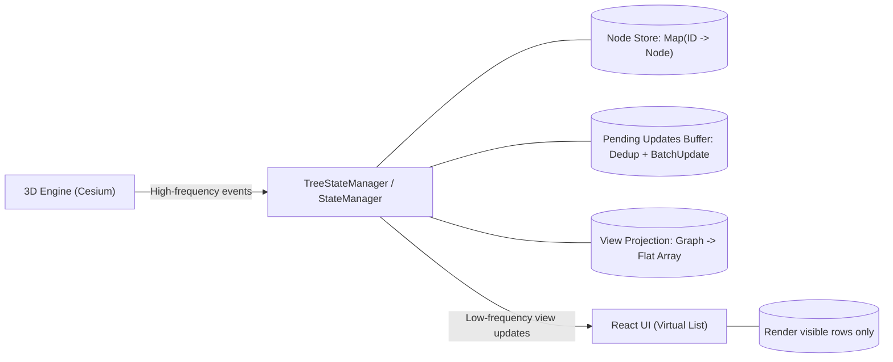

我们做传统的 React 开发时候习惯了数据驱动 UI，state 变了 UI 就变。


但是，当我们的数据源不是用户输入的表单，而是一个每秒钟都在疯狂变化的 3D 引擎（如 Cesium）时，传统的 React 模式会直接导致网页崩溃。


今天我想分享一下，我们是如何给狂奔的 Cesium 引擎“套上缰绳”，让它和 React 和平共处的。


## 1. 核心冲突：UI 线程 vs 渲染循环


Web 开发中存在两种截然不同的更新模式：

- React (UI Thread)：声明式，按需更新。追求准确性，任何状态变更都会触发 Diff 和 Re-render。
- 3D Engine (Game Loop)：命令式，60FPS 持续刷新。状态变更极其频繁（Loading/Culling/Moving）。

当 3D 场景加载大量模型时，Cesium 会在短时间内发出成百上千个“节点添加”事件。如果采用朴素的 onEvent -> setState 模式，主线程会被瞬间阻塞，导致页面无响应。


## 2. 抽象模型：场景图投影与同步


为了解决速率不匹配的问题，我们确立了核心观点：React 中的 Tree State 不再是 Source of Truth，它只是 3D 世界的一个低频投影。


我们构建了如下的架构模型：





我们引入了一个脱离 React 生命周期独立存在的类 TreeStateManager，它不仅仅是一个数据缓存，而是整个系统的可信源 (Source of Truth) 和流量阀。


它承担了三个关键职责：


### 1. 状态持有与 O(1) 索引 (State Holding)


它在内存中维护了一个完整的节点数据库。

- 利用 `Map<ID, Node>` 建立全量索引，确保任何一种通过 ID 查找节点的操作（如：根据 Cesium 点击事件反查树节点）都是 O(1) 复杂度。
- 维护节点的持久化状态（Opened/Checked），这些状态独立于 UI 存在，即使组件卸载重装，状态依然保留。

### 2. 流量整形 (Traffic Shaping)


面对 3D 引擎可能瞬间涌入的成千上万个状态变更事件（Add/Remove/Update），StateManager 充当了防洪堤的角色。

- 去重 (Deduplication)：同一毫秒内对同一个节点的多次修改（如：先变红再变绿）只保留最终态。
- 缓冲 (Buffering)：并不是来一个事件就通知一次 UI。而是维护一个 pendingUpdates 队列，通过 batchUpdate 机制，将高频的细碎更新合并为一次低频的 View Update。

### 3. 视图投影 (View Projection)


“怎么看数据”由它决定。它根据当前的 SortType（如：按 CAD 结构排序、按实体类型排序），动态地将内存中的非线性数据（Graph），实时计算出当前 UI 所需的那一个线性数组（Flat Array）。


这意味着底层节点数据只维护一份，可以生成不同的视图。但切换视图仍要重新投影；如果需要全量遍历或排序，成本会随节点数增长，并不是常数时间。


## 3. 关键实现策略


针对 3D 场景常见的深层嵌套，我放弃了直观的“递归组件”写法。


在早期实验中我发现，当树的深度（Depth）增加且节点数量庞大时，React 的递归组件会带来巨大的性能惩罚：

1. 如果构建树的逻辑本身使用深层递归，可能遇到调用栈限制；组件树很深也会增加维护成本。
2. 大量节点同时挂载或更新会增加协调和 DOM 工作量。这里观察到性能下降，但不能据此断言 React 的 Diff 开销随树深度指数增长。

因此，我们在内存中维护一个扁平数组 flatNodeArray，通过 depth 属性标识层级。

- 优势：虚拟列表（Virtual List）只挂载视口内的行，让一次渲染主要取决于可见行数 V，而不是总节点数 N。
- 代价：展开、折叠和重新排序仍可能需要遍历或重建可见数组，成本不会因为虚拟化而自动变成 O(V)。

### 策略 B：异步时间分片 (Time Slicing)


这是缓解“假死”的关键。不仅使用批处理（Batching），还把构建任务分批，并在批次之间把控制权交还给浏览器。仅等待一个已经解决的 Promise 会继续占用微任务队列，不能保证浏览器有机会绘制下一帧。


```javascript
// 伪代码：在异步函数中分批处理
for (let offset = 0; offset < items.length; offset += 100) {
  process(items.slice(offset, offset + 100));
  await new Promise(requestAnimationFrame); // 让浏览器有机会处理下一帧
}

```


## 4. 数据结构带来的功能实现上的性能红利


架构的选择往往不仅解决了当下的性能问题，简化后续功能的实现。最典型的例子就是 Shift+多选 功能。


在旧版本（基于递归的树）中，当我们在一个包含 2万个节点的 4 层深树上执行“范围全选”时，浏览器会直接假死 10 秒左右。因为算法不得不在深层嵌套的 DOM 树中疯狂递归，查找路径和状态。


但在我们的扁平化数组 (Flat Array) 架构下，这道难题迎刃而解：


```javascript
// 伪代码：在扁平数组中实现范围选择
const rangeSelection = (startId, endId) => {
  const startIndex = nodePositionMap.get(startId);
  const endIndex = nodePositionMap.get(endId);
  if (startIndex === undefined || endIndex === undefined) return [];

  // 只得到当前可见列表中的范围；隐藏的子孙节点另行处理
  return flatNodeArray.slice(
    Math.min(startIndex, endIndex),
    Math.max(startIndex, endIndex) + 1
  );
};

```


另外一个例子是树形控件中最复杂的状态莫过于 Checkbox 的级联更新（全选/反选）。


在传统递归树中，如果每个子节点都各自触发 UI 更新，勾选一个包含大量子节点的父级可能造成明显卡顿。在我们的架构中，节点状态先在内存里批量更新，再通知可见列表：

1. 索引查找：Map 可以按 ID 常数时间找到单个节点；收集全部子孙仍需遍历相关节点。
2. 批量修改：在数据 Store 中更新约 26,000 个节点，这部分工作至少随更新节点数增长。
3. 按需绘制：VirtualList 只渲染屏幕可见的约 20 行，避免为所有被修改的节点创建或更新 DOM。

## 5. 实验数据与性能验证


为了观察这套架构在不同规模下的表现，我们在中等规模和高负载规模两种真实场景下进行了性能埋点测试。


测试环境：Chrome / M2 Chip


对比组：中级场景 (7,000 Nodes) vs 高级场景 (68,500 Nodes)


以下是三大场景的实测数据对比：


### 实验一：视图构建与渲染性能 (Build & Render)


这是最基础的性能指标，衡量这套“扁平化 + 时间分片”架构能否扛住大数据量的冲击。


| 关键指标                 | 中级场景 (7k Nodes) | 重载场景 (6.8w Nodes) | 架构解读                                                                                                |
| -------------------- | --------------- | ----------------- | --------------------------------------------------------------------------------------------------- |
| Tree:Flatten(层级拍平)   | 0.8 ms          | 4.3 ms            | 这两组数据表明该步骤在这些场景里仍较快；不能仅凭两点证明一般情况下的线性复杂度。 |
| Tree:FullBuild(全量构建) | 290 ms          | 2,804 ms          | 总构建时间接近随规模增长。时间分片让工作分布在多个批次，但还需要帧率或交互延迟数据才能证明构建期间没有卡顿。 |

### 实验二：交互响应速度 (Shift+Select Range)


这是对架构设计最极致的考验。我们在 3D 场景中进行“隐藏式全选”测试：用户只选中了可视区域的几十个文件夹，但其内部包含了数万个折叠的 3D 实体。


| 操作场景          | 旧方案（回忆/估计） | 本架构（单次实测） |
| ------------- | ------------- | ------------ |
| 选中 80,000 个实体 | 约 10,000 ms | 263 ms |

解读：可见行的范围可以通过数组索引取得，但选中隐藏的子孙节点仍需额外收集和更新。263 ms 是这次操作的总体实测值，不能归因于 `Array.slice` 一步。旧方案的 10 秒不是同条件实测，因此这里不计算加速倍数。


### 实验三：状态级联更新 (Checkbox Cascade)


测试用户点击根节点“全选”时，系统递归更新所有子孙节点状态的性能。


| 测试指标              | 数据规模       | 耗时      | 结果   |
| ----------------- | ---------- | ------- | ---- |
| Tree:CheckCascade | 26,419 个节点 | 72.6 ms | 实时响应 |

解读：在这次测试中，约 2.6 万个节点的内存状态更新用了 72.6 ms。它不等于从点击到画面更新的完整延迟；要判断交互体验，还需要测量浏览器绘制和输入响应。


这些数据说明这套设计在所测场景中可用，也指出了全量构建和大范围状态更新仍有可见成本。若要论证可扩展性，还需要更多规模点、重复运行和交互延迟指标。


## 6. 总结


在处理 3D 引擎与 React 结合的复杂工程中，我们往往容易陷入怪圈：试图用更复杂的 React 技巧（memo, useMemo）去修补性能漏洞。


但这套架构的实践告诉我们：性能问题的终极解法，往往不在代码层面的修修补补，而在于底层数据逻辑的重构。


通过引入中间层，我们把高频场景事件先汇总，再按较低频率更新 React 视图。虚拟列表减少了同时挂载的 DOM 行数，但全量数据处理和大范围状态更新仍随节点数增长。


在上述 Cesium 场景树测试里，这种做法减少了渲染工作量。把数据更新与可见行渲染分开的思路，也可能用于日志监控或复杂表格等高频更新界面：

1. 脱离框架思考：不要被 React 的声明式模型束缚，敢于在 Side Effect 中管理自己的数据流。
2. 拥抱最终一致性：在人眼无法感知的毫秒级缝隙里，用“批处理”和“时间分片”换取系统的吞吐量。
3. 数据结构致胜：在面对数万级节点时，选择 Flat Array 还是 Recursive Tree，这一个决定可能比写 1000 行优化代码更管用。

希望这套“驯服狂奔引擎”的经验，能为您解决类似的高频同步难题带来一点启发。
