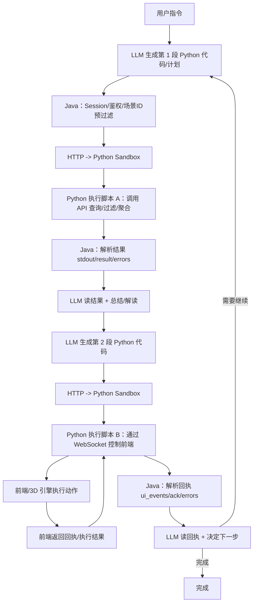

---
categories:
  - Technology
  - Ai
date: "2025-12-18 00:00:00"
description: 一次重构数字孪生系统的尝试经验 (1)
readingTime: 8
title: 一次基于 Anthropic MCP-as-Code 的重构尝试：以及它在数字孪生场景中的代价
---

背景：这是一个“规模先行”的问题

在我负责的数字孪生系统中，一个典型场景里往往存在上万个 entity。

每个 entity 又包含 2000～3000 token 规模的属性数据（状态、指标、业务字段等）。

更现实的问题是：

即便不考虑完整属性，仅仅是 ID 本身的规模，也已经构成了压力。

举个非常具体的例子：

在某些场景中，可能同时存在上万个建筑。

仅仅是把这些建筑的 ID 列表完整传递给 LLM，用于后续决策或操作，所消耗的 token 数量就已经足以压垮上下文窗口，更不用说附带的属性信息。

这意味着一个事实：

> 任何试图把“完整场景数据”直接塞进 LLM 上下文，再让模型做决策的方案，在规模上都是不可持续的。

---

## **原有方案：基于 MCP Tool 的直接调用模式**

在开始重构之前，我使用的是一种相对直接的 MCP Tool 调用方式：

- 向模型注入两组 MCP Tools：
  - 一组用于查询场景数据
  - 一组用于控制 3D 场景（如上色、隐藏、变换）
- LLM 的角色更接近一个“指挥器”：
  - 根据用户指令调用 API
  - 拿到结果
  - 再调用控制指令
例如对「把所有建筑染红」这样的请求：

1. 调用 Tool 查询所有建筑的 ID
1. 调用 Tool 对这些 ID 执行上色操作
这个模式的优点非常明确：

- 延迟低
- 失败前置（参数类型、Schema 在调用前即可校验）
但随着场景规模扩大，它开始逼近极限。

---

## **第一个瓶颈：上下文与数据规模的失控**

问题并不在于“能不能查到数据”，而在于：

- entity 数量巨大
- Schema 动态且属性维度极高
- LLM 无法、也不应该看到完整数据
在 MCP Tool 模式下，我逐渐意识到：

LLM 真正需要的，并不是“所有数据”，

而是决定“如何处理数据”的能力

换句话说，我希望 LLM 输出的是“处理逻辑”，而不是被迫吞下成千上万条实体数据。

---

## **转折点：Anthropic 的 MCP-as-Code 思路**

正是在这个背景下，我读到了 Anthropic 的这篇文章：

> Code Execution with MCP

> https://www.anthropic.com/engineering/code-execution-with-mcp

文章提出了一个非常有吸引力的思路：

- 将 MCP Server 视为代码库 / API
- 不再把所有工具能力以 JSON Schema 的形式直接注入给模型
- 而是：
  - 让模型编写代码（如 Python 或 TypeScript）
  - 在受控的 sandbox 中运行
  - 只把执行结果的摘要返回给模型
其中一句话对我触动很大：

对于大数据集，模型不需要看到 1 万行数据，只需要看到“前 5 行结果”或统计值。

这几乎是为当前问题量身定制的解法。

---

## **理想中的收益：我当时的预期**

在开始重构时，我对 MCP-as-Code 有非常明确的期待：

- 大规模数据的过滤、聚合、统计全部放到后台执行
- LLM 只需要看到**结果**
- 上下文压力显著降低
- 模型从“工具选择器”升级为“逻辑编写者”
从抽象层面看，这是一种非常优雅的设计。

---

## **实际落地方案：Java + Python Sandbox 的分层**

考虑到现有系统架构，我并没有推翻一切，而是引入了一层 Python Sandbox：

- **Java 层**
  - Session 管理
  - API 调用
  - 场景数据的预过滤
    （例如：先向前端确认当前场景中存在的 ID，把不在场景中的数据过滤掉）
- **Python Sandbox**
  - 通过 HTTP 与 Java 通信
  - 执行 LLM 生成的 Python 代码
  - 在代码中调用 MCP API 或通过 WebSocket 控制前端
  - 返回 stdout、result、ui_events、errors
从执行模型上看，LLM 不再是“直接调用 Tool”，而是进入了：

写代码 → 执行 → 解读结果 → 再写代码

下图展示了 MCP-as-Code 重构后，LLM、Java 核心系统、Python Sandbox 以及前端之间的实际执行链路。需要注意的是，这条链路在真实交互中是**被频繁打断、并以多轮循环形式运行的**。

---

这个执行模型与最初设想的“一段脚本完成多步逻辑”存在明显差异，也正是后文延迟上升和失败成本被放大的根本原因。

## **现实问题一：执行链路被频繁“打断”**

我原本设想的是：

> 一段 Python 脚本中完成多步逻辑，

> 效果等价于“多个 MCP Tool 一次性执行”。

但在真实的数字孪生交互场景中，这个假设很快被打破。

### **一个典型执行过程变成了：**

1. LLM 先写一段 Python，查询或过滤建筑 ID
1. Java / Python 执行完成后，将结果返回给 LLM
1. **LLM 必须先解读和总结结果**
1. 再生成下一段 Python，通过 WebSocket 控制前端上色
1. 前端返回执行结果
1. LLM 再决定是否继续下一步
也就是说，脚本往往只执行了一小步就被迫中断，等待下一轮决策。

这直接导致：

- 原本期望的“一次执行多步”
- 在现实中退化成了多轮串行往返
---

## **现实问题二：延迟与失败成本被放大**

### **延迟问题**

一些非常简单的指令，例如：

“把所有建筑染红”

在重构前平均耗时约 2 秒，

而在 MCP-as-Code 模式下，经常达到 10** **秒以上。

核心原因包括：

- 动态 Schema 带来的探索成本
- 多轮 LLM 生成与总结
- Python / Java / 前端之间的多次往返
### **容错模型的根本差异**

在原有 MCP Tool 模式中：

- Java 端有 JSON Schema Validator
- 参数类型错误会在**执行前**被直接拒绝
而在 Python Sandbox 中：

- 错误发生在**运行时**
- 往往伴随完整的 Error Stack Trace
- LLM 需要“读错误 → 理解 → 重写整段代码 → 再执行”
在强 Schema、强约束、强实时性的数字孪生场景中，这种失败模型的代价被明显放大。

---

## **小结：MCP-as-Code 并不是银弹**

这次重构让我意识到：

MCP-as-Code 擅长在处理复杂分析与大数据集但在高频、交互式、强约束

Tool 模式和 Code 模式，并不存在绝对的优劣，它们本质上服务于不同的问题类型。

回顾整个 MCP-as-Code 的重构过程，出现了三类问题：

这些问题并不取决于我用的是 Java、Python，或具体的 MCP API 设计，

而更像是某种结构性约束的外在表现。

为了避免继续在实现层面反复试错，我尝试用一个更抽象的模型，把这些现象统一描述清楚。

下篇我会用一个分层抽象模型，重新审视 MCP 与 Code-as-MCP 的差异来源。

---

